## OUTDATED
Please note that currently the documentation lags behind the development of the program, in particular in the area 
related to starting masternodes. It will be improved according to the resources available. 

# Hatch Masternode Tool (HMT)

## Contents

 * [Masternodes](#masternodes)
 * [Hatch Masternode Tool](#hatch-masternode-tool)
   * [Feature list](#feature-list)
   * [Supported hardware wallets](#supported-hardware-wallets)
 * [Configuration](#configuration)
   * [Setting up the hardware wallet type](#setting-up-the-hardware-wallet-type)
   * [Connection setup](#connection-setup)
     * [Connection to a local node](doc/config-connection-direct.md)
     * [Connection to a remote node through an SSH tunnel](doc/config-connection-ssh.md)
     * [Connection to "public" JSON-RPC nodes](doc/config-connection-proxy.md)
   * [Masternode setup](#masternode-setup)
     * [Scenario A: moving masternode management from Hatch Core](doc/config-masternodes-a.md)
     * [Scenario B: configuring a new masternode](doc/config-masternodes-b.md)
   * [Command line parameters](#command-line-parameters)
 * [Features](#features)
   * [Starting a masternode](#starting-a-masternode)
   * [Registration of a deterministic masternode](doc/deterministic-mn-migration.md)
   * [Transferring masternode earnings](#transferring-masternode-earnings)
   * [Signing messages with a hardware wallet](#signing-messages-with-a-hardware-wallet)
   * [Changing a hardware wallet PIN/passphrase](#changing-a-hardware-wallet-pinpassphrase)
   * [Browsing and voting on proposals](doc/proposals.md)
   * [Hardware wallet initialization/recovery](doc/hw-initialization-recovery.md)
     * [Updating hardware wallet firmware](doc/hw-initr-update-firmware.md)
 * Building the HMT executables
    * [macOS](doc/build-hmt-mac.md)
    * [Windows](doc/build-hmt-windows.md)
    * Linux
       * [Ubuntu](doc/build-hmt-linux-ubuntu.md)
       * [Fedora](doc/build-hmt-linux-fedora.md)
 * [Downloads](https://github.com/hatchpay/hatch-masternode-tool/releases/latest)
 * [Changelog](changelog.md)

## Masternodes

Hatch masternodes are full nodes which are incentivized by receiving a share of the block reward as payment in return for the tasks they perform for the network, of which the most important include participation in *InstantSend* and *PrivateSend* transactions. In order to run a masternode, apart from setting up a server which runs the software, you must dedicate 1000 Hatch as *collateral*, which is *"tied up"* in your node as long as you want it to be considered a masternode by the network. It is worth mentioning that the private key controlling the funds can (and for security reasons, should) be kept separately from the masternode server itself.

A server with the Hatch daemon software installed will operate as a Hatch full node, but before the rest of the network accepts it as a legitimate masternode, one more thing must happen: the person controlling the node must prove that they are also in control of the private key to the node's 1000 Hatch *collateral*. This is achieved by sending a special message to the network (`start masternode` message), signed by this private key.

This action can be carried out using the *Hatch Core* reference software client. As can be expected, this requires sending 1000 Hatch to an address controlled by the *Hatch Core* wallet. After the recent increase in the value of Hatch and a burst in the amount of malware distributed over the Internet, you do not have to be paranoid to conclude that keeping large amounts of funds in a software wallet is not the most secure option. For these reasons, it is highly recommended to use a **hardware wallet** for this purpose.

# Hatch Masternode Tool

The main purpose of the application is to give masternode operators (MNOs) the ability to send the `start masternode` command through an easy to use a graphical user interface if the masternode collateral is controlled by a hardware wallet such as Trezor, KeepKey or Ledger.

## Feature list

* Sending the `start masternode` command if the collateral is controlled by a hardware wallet
* Transferring masternode earnings safely, without touching the 1000 Hatch funding transaction
* Signing messages with a hardware wallet
* Voting on proposals
* Initialization/recovery of hardware wallets seeds
* Updating of hardware wallets firmware (Trezor/KeepKey)
* Support for Hatch Testnet

## Supported hardware wallets

- [x] Trezor (model One and T)
- [x] KeepKey
- [x] Ledger Nano S

Most of the application features are accessible from the main program window:  
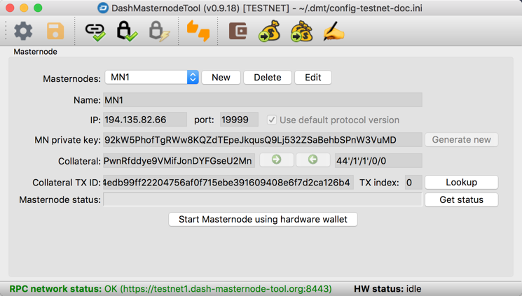

# Configuration

## Setting up the hardware wallet type
 * Click the `Configure` button.
 * Select the `Miscellaneous` tab in the configuration dialog that appears.
 * Depending on the type of your hardware wallet, select the `Trezor`, `KeepKey` or `Ledger Nano S` option.  
     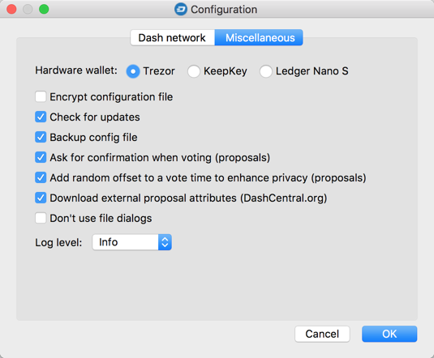

## Connection setup

Most of the application features involve exchanging data between the application itself and the Hatch network. To do this, *HMT* needs to connect to one of the full nodes on the network, specifically one which can handle JSON-RPC requests. This node plays the role of a gateway for *HMT* to the Hatch network. It does not matter which full node node provides the service, because all nodes reach consensus by synchronizing information between each other on the Hatch network.

Depending on your preferences (and skills) you can choose one of three possible connection types:
 * [Direct connection to a local node](doc/config-connection-direct.md), for example to *Hatch Core* running on your normal computer.
 * [Connection to a remote node through an SSH tunnel](doc/config-connection-ssh.md), if you want to work with a remote Hatch daemon (like your masternode) through an SSH tunnel.
 * [Connection to "public" JSON-RPC nodes](doc/config-connection-proxy.md), if you want to use nodes provided by other users.

## Masternode setup

Here we make the following assumptions:
  * You already have a server running the Hatch daemon software (*hatchd*) that you want to use as a masternode. If you don't, you will need to install and configure one first by following the guide on the [Hatch Wiki](https://docs.hatch.ga/en/stable/masternodes/setup.html).
  * We occasionally refer to the *hatchd* configuration file, so it is assumed that *hatchd* is running under a Linux operating system (OS), which is the most popular and recommended OS for this purpose.
  * Your server has a public IP address that will be visible on the Internet.
  * You have set up a TCP port on which your *hatchd* listens for incoming connections (usually 8888).

Further configuration steps depend on whether you already have a masternode controlled by *Hatch Core* which you want to migrate to a hardware wallet managed by *HMT*, or if you are setting up a new masternode.

[Scenario A - moving masternode management from Hatch Core](doc/config-masternodes-a.md)  
[Scenario B - configuration of a new masternode](doc/config-masternodes-b.md)

## Command line parameters

The application currently supports the following command-line parameters:
* `--data-dir`: a path to a directory in which the application will create all the needed files, such as: configuration file, cache and log files; it can be useful for users who want to avoid leaving any of the application files on the computer - which by default are created in the user's home directory - and insted to keep them on an external drive
* `--config`: a non-standard path to a configuration file. Example:
  `HatchMasternodeTool.exe --config=C:\hmt-configs\config1.ini`


# Features

## Starting a masternode

Once you set up the Hatch daemon and perform the required *HMT* configuration, you need to broadcast the `start masternode` message to the Hatch network, so the other Hatch nodes recognize your daemon as a masternode and add it to the payment queue.

To do this, click the `Start Masternode using Hardware wallet` button.

### Sequence of actions

This section describes the steps taken by the application while starting the masternode, and possible errors that may occur during the process.

The steps are as follows:

1. Verification that all the required fields are filled with correct values. These fields are: `IP`, `port`, `MN private key`, `Collateral`, `Collateral TX hash` and `TX index`.
  An example message in case of errors:  
  

2. Opening a connection to the Hatch network and verifying if the Hatch daemon to which it is connected is not still waiting for synchronization to complete.
  Message in case of failure:  
  

3. Verification that the masternode status is not already `ENABLED` or `PRE_ENABLED`. If it is, the following warning appears:  
    
  If your masternode is running and you decide to send a `start masternode` message anyway, your masternode's payment queue position will be reset.

4. Opening a connection to the hardware wallet. Message in case of failure:  
  

5. If the `BIP32 path` value is empty, *HMT* uses the *collateral address* to read the BIP32 path from the hardware wallet.

6. Retrieving the Hatch address from the hardware wallet for the `BIP32 path` specified in the configuration. If it differs from the collateral address provided in the configuration, the following warning appears:  
    
  The most common reason for this error is mistyping the hardware wallet passphrase. Remember that different passphrases result in different Hatch addresses for the same BIP32 path.

7. Verification that the specified transaction ID exists, points to your collateral address, is unspent and is equal to exactly 1000 Hatch. Messages in case of failure:  
    
    
  If you decide to continue anyway, you probably won't be able to successfully start your masternode.

8. Verification at the Hatch network level that the specified transaction ID is valid. Message in case of failure:  
  

9. After completing all pre-verification, the application will ask you whether you want to continue:  
    
  This is the last chance to stop the process.

10. Sending the `start masternode` message. Success returns the following message:  
    
  In case of failure, the message text may vary, depending on the nature of the problem. Example:  
  

## Transferring masternode earnings

HMT version 0.9.4 and above allows you to transfer your masternode earnings. Unlike other Hatch wallets, HMT gives you a 100% control over which *unspent transaction outputs* (utxo) you want to transfer. This has the same effect as the `Coin control` functionality implemented in the *Hatch Core* wallet.

The `Transfer funds` window shows all *UTXOs* of the currently selected Masternode (mode 1), all Masternodes in current configuration (mode 2) or any address controlled by a hardware wallet (mode 3). All *UTXOs* not used as collateral are initially selected. All collateral *UTXOs* (1000 Hatch) are initially hidden to avoid unintentionally spending collateral funds and thus breaking MN. You can show these hidden entries by unchecking the `Hide collateral utxos` option.

To show the `Transfer funds` window, click the `Tools` menu. Then, from the popup menu choose:
 * `Transfer funds from current Masternode's address` (mode 1)
 * `Transfer funds from all Masternodes addresses` (mode 2)
 * `Transfer funds from any address` (mode 3)

The same you can achieve by clicking of the three buttons from the right side of the app's toolbar:
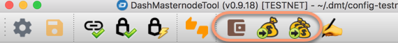

Transferring funds from masternode collateral addresses (mode 2):  
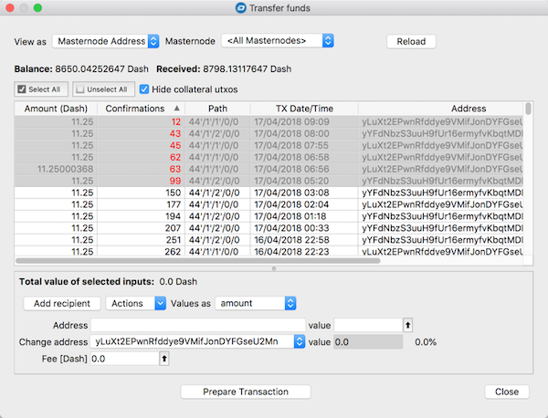

Transferring funds from any address controlled by a hardware wallet, using BIP32 path as an input (mode 3):  
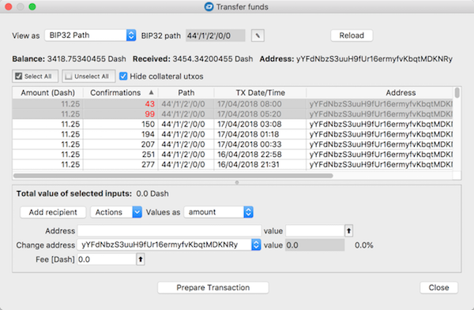

and using *wallet account* as an input (mode 3):  
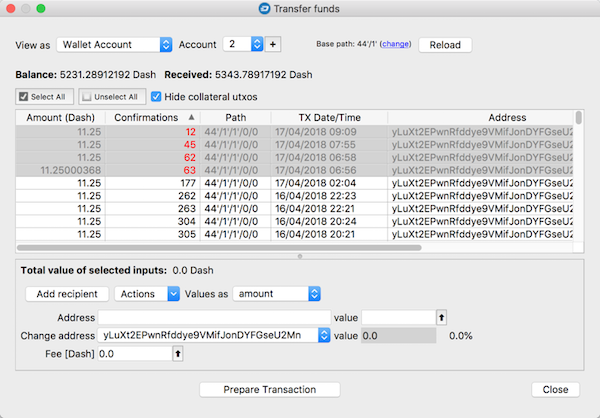

> Important: rows with a red font in the *Confirmations* column and a gray background are related to so-called *coinbase* transactions, that don't have the required number of confirmations to forward them. You should restrain from sending them and wait for them to receive at least 100 confirmations. 

To send funds, select all *UTXOs* you wish to include in your transaction, enter the details of the recipient(s), verify the transaction fee and click the `Prepare Transaction` button on the bottom: 
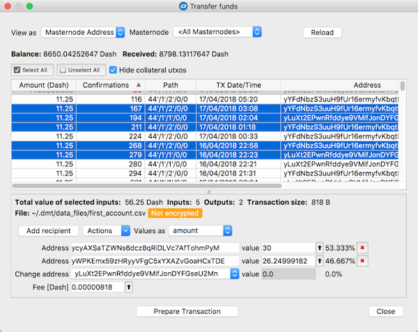

After signing the transaction with your hardware wallet, the application will display a summary and will ask you for confirmation for broadcasting the signed transaction to the Hatch network.  
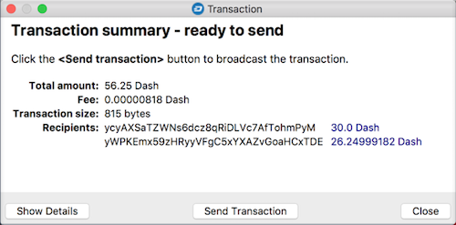

After clicking `Send Transaction`, the application broadcasts the transaction and then shows a confirmation with a transaction ID as a hyperlink directing to a Hatch block explorer:  
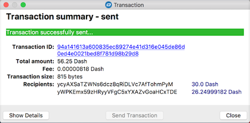

## Signing messages with a hardware wallet

To sign a message with your hardware wallet, click the `Tools` button and then select the `Sign message with HW for current Masternode's address` menu item. The `Sign message` window appears:  
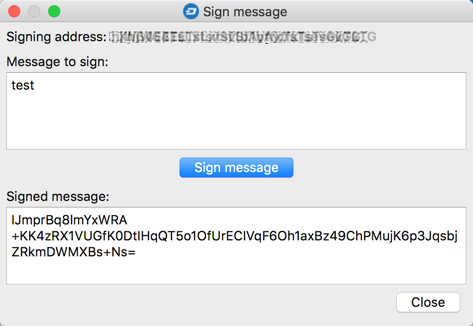

## Changing hardware wallet PIN/passphrase

Click the `Tools` button and select the `Hardware wallet PIN/Passphrase configuration` item. The following window will appear to guide you through the steps of changing the PIN/passphrase:  
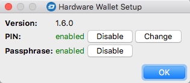

## Downloads

This application is written in Python 3, but requires several additional libraries to run. These libraries in turn require the installation of a C++ compiler. All in all, compiling HMT from source is not trivial for non-technical people, especially the steps carried out under Linux (though this will be documented soon).

For this reason, in addition to providing the source code on GitHub, binary versions for all three major operating systems - macOS, Windows (32 and 64-bit) and Linux - are available for download directly. The binaries are compiled and tested under the following OS distributions:
* Windows 7 64-bit
* macOS 10.13.2 High Sierra
* Linux Debian Jessie

Binary versions of the latest release can be downloaded from: https://github.com/hatchpay/hatch-masternode-tool/releases/latest.

### Verification of the application binary files
Beginning with version 0.9.15, each binary file forming part of a release has a corresponding signature file that you can use to verify the authenticity of the downloaded binary file (to ensure it has not been corrupted or replaced with a counterfeit) and confirm that it has been signed by the application author (Keybase user: hatchpay).

The verification method described below is based on use of the Keybase application, so if you have not already done so, download the installer from https://keybase.io/download and install the app.

**Verification steps**

1. Open your OS command line terminal

2. Change the current directory to the folder where the HMT release files were downloaded:

   `cd /Users/<username>/hmt-dist`

   After invoking the *list directory* command (`ls` for Mac/Linux, `dir` for Windows ) you should see both the archived executable (.tar.gz, .zip) and the corresponding signature file (.asc):

   ```
   <username>: ls
   HatchMasternodeTool_0.9.15.mac.zip    HatchMasternodeTool_0.9.15.mac.zip.asc
   ```


3. Verify the signature by executing the following command:

   ```
   keybase pgp verify -d HatchMasternodeTool_0.9.15.mac.zip.asc -i HatchMasternodeTool_0.9.15.mac.zip -S hatchpay
   ```

   You should see something similar to the following if verification was successful:

   ```
   ▶ INFO Identifying hatchpay
   ✔ public key fingerprint: 8044 DCB5 D241 349F 815F 9522 0D8F 46CA A62F 7EFD
   ฿  bitcoin 1BkMySjL6K72LWX82SVVmgCuZCuZ3DfuxS
   ฿  zcash t1byMTzteuJ8n1XUwxBzYXXV8qVv5kh3bFn
   ✔ "hatchpay" on reddit: https://www.reddit.com/r/KeybaseProofs/comments/688799/my_keybase_proof_reddithatchpay/ [cached 2018-01-19 10:27:37 CET]
   ✔ "hatchpay" on github: https://gist.github.com/781be961e33042c68d617782b0060844 [cached 2018-01-19 10:27:37 CET]
   Signature verified. Signed by hatchpay 1 hour ago (2018-01-19 11:46:05 +0100 CET).
   PGP Fingerprint: 8044dcb5d241349f815f95220d8f46caa62f7efd.
   ```
