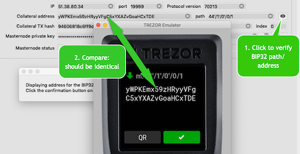
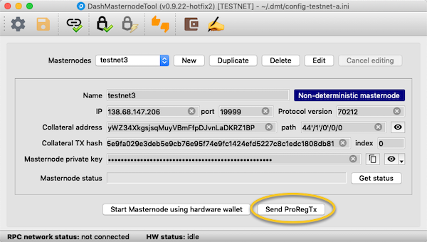
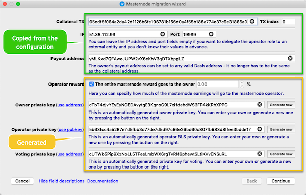
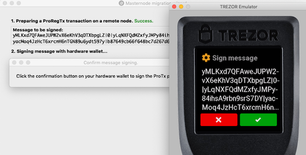
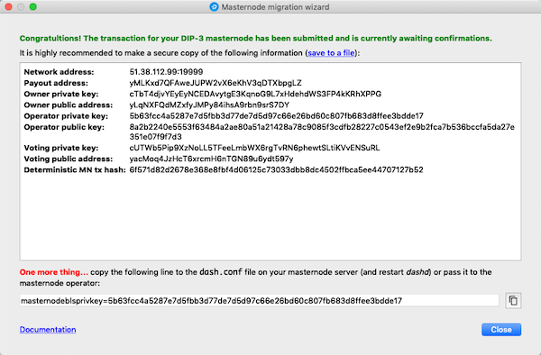
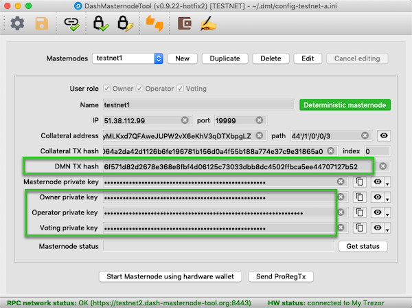
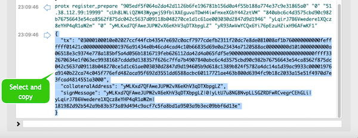

# Registration of a deterministic masternode

Registration of a deterministic masternode is a process of adding a
masternode to the **Deterministic Masternode List** - a list
which after activating the **Spork 15** parameter will start to be used
by the network to accomplish the functionalities related to
masternodes. The registration process involves sending a special
transaction (**ProRegTx**) in which all the necessary information is
provided.

The scope covered in this document applies only to what directly relates
to the HMT functionalities and it focuses on the migration from
nondeterministic to deterministic (DIP3) masternodes. To get familiar
with a broader context in this matter, read the following document:
[Hatch 0.13 Upgrade Procedure](https://docs.hatch.ga/en/stable/masternodes/dip3-upgrade.html#masternode-registration-from-hmt),
which I highly recommend.

It's worth noting here, that this process can be performed completely
independently from HMT (using the Hatch Core wallet), however, the
inclusion of this function in HMT is aimed at the maximum facilitation
of this process.

### Contents
  * [Preliminary checks](#preliminary-checks) 
  * [Use cases covered by this document](#use-cases-covered-by-this-document)  
  * [HMN registration methods](#hmn-registration-methods) 
    * [Automatic method using "public" RPC nodes](#automatic-method-using-public-rpc-nodes-m1)
    * [Automatic method using own RPC node](#automatic-method-using-own-rpc-node-m2)
    * [Manual method using own Hatch node](#manual-method-using-own-hatch-node-m3)
  * [FAQ](#faq)

### Glossary
**DIP3**: Hatch blockchain parameter, enabling the Deterministic
Masternode Lists (**DML**) feature. On mainnet it has been activated
with the block 1,028,160 being mined. From that moment, you can start
adding masternodes to DML, however the new list will not be used until
**Spork 15** is activated.

**Spork 15**: a parameter causing the Hatch network to switch from the
old (non-deterministic) masternode list to DML. The exact date of the
activation of Spork 15 is not currently known - it will mostly depend on
the pace of **DIP3** adoption among masternodes. The most probable
moment for this to happen is when about 80% of masternodes are added to
DML, but the final decision will be made by the _Hatch Core Group_
members, who will choose the most optimal timing for this.

**ProRegTx**: type of special transaction related to the registration of
deterministic masternodes.

**RPC node**: a Hatch node providing an interface for external apps to
communicate with the Hatch network. HatchMasternodeTool (**HMT**) requires
connection with such node to carry out the most of its
functionalities.

**HMN**: a Deterministic Masternode - a masternode which has been added
to the Deterministic Masternode List.

## Preliminary checks
Before starting the process you should verify the masternode-related 
information kept in HMT. In the screenshot below, the fields important
in the process are marked with an ellipse:

### Checklist
- Check if the IP address and TCP port number are correct.
- Check if the collateral transaction hash/index are correct.
- Check if the collateral address and the related BIP32 path are
  correct. Verification of this in HMT:  
  
- Close all other programs that could communicate with the same hardware
  wallet device which you use in HMT (eg. Trezor online wallet). Two (or
  more) programs communicating with the same device simultaneously can
  interfere with each other's communication in such a way that they may
  receive incorrect results.

## Use cases covered by this document 
There are several possible use cases related to registration of a
deterministic masternode, but this document covers the two most popular
ones:

* **UC1.** The owner is also the masternode operator or - if using an
  external operator - the owner has control over the operator private
  key.
  
* **UC2.** The owner employs an external entity (operator) to manage the
  server running the masternode software and the operator takes the
  responsibility for generating and storing the operator private key. 

>  Note: if you use the external operator, it usually depends on him
>  which scenario you will need fulfill to perform the process. Most
>  operators impose the second approch and actually it is the most
>  convenient (for them) and the most secure (for both parties) method.

## HMN registration methods
* [Automatic method using "public" RPC nodes (M1)](#automatic-method-using-public-rpc-nodes-m1) 
* [Automatic method using own RPC node (M2)](#automatic-method-using-own-rpc-node-m2) 
* [Manual method using own Hatch node (M3)](#manual-method-using-own-hatch-node-m3)

In the automatic method, the majority of activities are performed by HMT
"in the background" and the required user interaction basically boils
down to clicking the **Continue** button.

On the other hand, the manual method requires executing commands from
the Hatch Core debug console and copying the results back to HMT, so it
is dedicated to more advanced users, who are not afraid of
using a terminal-type user interface.

#### Which method to choose?
Each method has its pros and cons that you can read about in individual
chapters, but here are some tips to help you choose the best method for
you :
- If you have your own Hatch Core synchronized with the network with 
  enabled RPC and indexing, choose either
  [Automatic method using own RPC node](#automatic-method-using-own-rpc-node-m2)
  or
  [Manual method using own Hatch node](#manual-method-using-own-hatch-node-m3).
- If you have your own Hatch Core synchronized with the network but
  without the RPC interface or indexing enabled, choose
  [Manual method using own Hatch node](#manual-method-using-own-hatch-node-m3).
- If you do not have and you can not easily run Hatch Core (for example,
  you don't have disk space for blockchain data) or you feel
  uncomfortable using a terminal-type user interface, choose
  [Automatic method using "public" RPC nodes](#automatic-method-using-public-rpc-nodes-m1).

## Automatic method using "public" RPC nodes (M1)
The advantage of this method is its simplicity but the disadvantage is
the need to send the owner private key to the remote RPC node. This key
is necessary to sign the payload data being part of the ProRegTx
transaction, which is created on the remote node
([details](https://github.com/hatchpay/dips/blob/master/dip-0003.md#registering-a-masternode-proregtx)).
If this raises your concerns (eg. you do not trust the RPC node
operator), choose another method.

>  **Note 1.** The RPC nodes preconfigured in HMT (alice, luna, suzy)
>  are managed by the author of the HMT application (ie by me). For my
>  part, I can ensure that no sensitive information (such as private
>  keys) is logged anywhere. All parameters are passed to the Hatch
>  daemon, and after signing the transaction they disappear.

>  **Note 2**. What would happen if the operator's key fell into the
>  wrong hands? Taking into possesion of this key does not allow
>  collateral theft (which is controlled by hardware wallet), but may
>  have some financial aspect. Namely, it allows sending a
>  [ProUpRegTx](https://github.com/hatchpay/dips/blob/master/dip-0003.md#updating-registrar-of-masternode-proupregtx)
>  transaction, which allows to change the payout address. In an extreme
>  case, you may then lose your masternode reward - one or a few -
>  depending on when you would notice the change. Protection against
>  this is quite simple - it is enough to monitor changes in the payout
>  address and owner key using data available on the Hatch network. This
>  feature is implemented in HMT under the **Get status** button. If
>  there is a change in relation to the data stored in the
>  configuration, a warning will be displayed. If something like that
>  happens, you must immediately generate a new ProRegTx transaction
>  with a new set of keys.

#### Step 1. Select the masternode you want to migrate
You do this in the main HMT window.

#### Step 2. Start _Masternode migration wizard_ 
Do it by clicking the **Send ProRegTx** button on the bottom right of
the main HMT window.

> Note, the **Send ProRegTx** button is only visible if the DIP3
> parameter is active. If you are sure that this is the case and the
> button is still not visible, make HMT to establish the connection with
> the Hatch network to force it to read the current network parameters.
> You can do this by clicking the **Check Hatch Network Connection**
> toolbar button.

#### Step 3. Verify and update the data if necessary 
The first page of the wizard contains a set of data needed in the next
steps. Some of them have been copied from the masternode configuration,
while the remaining ones (private keys) are filled with auto-generated
values.

**Payout address**  
The only data derived from the configurations you might want to change
is the **payout address**. The default value is the collateral address,
but in the new model you can enter any address here. Thanks to this, you
get the option of separating the payout address from the collateral
address, eg. by placing them in different wallets. Note that this option
will be effective after activating **Spork 15**. Until then, you will
receive payments to the collateral address.

**Private/public keys**  
Other actions in this step depend on your use case:
* **UC1**: you do not have to change anything, but you can enter your
  own owner, operator and voting private keys 
* **UC2**: in this case your masternode operator should have sent you an
  operator public key. Click the **use pubkey** link next to the
  **Operator private key** label then enter the public key in the edit
  field on the right:  
  

> Note: in the period when Spork 15 is inactive, the **Voting private
> key** field will not be shown - in this case the voting key has to be
> the same as the owner key. Separation of keys will be possible after
> activating Spork 15.
  
After completing the data, click **Continue**.

#### Step 4. Select the registration method 
Click the option **Remote Hatch RPC Node (automatic method)**

then click **Continue**

#### Step 5. Confirm the message signing operation on your hardware wallet  
At this step, the wizard executes two operations on the remote Hatch node
(**register_prepare** and **register_submit**), between which you will
be asked to sign a special message with the hardware wallet controlling
the masternode collateral. The resulting signature is supposed to prove
that you really have the collateral private key under your control and
that you're not trying to hijack a someone else's collateral
transaction.

If the operation completes without an error, the wizard will
automatically go to the summary page.

#### Step 6. Summary - final actions
  

The summary page will show all relevant values (eg. private keys) used
during the process. Most of them will be copied to the masternode
configuration in HMT, nevertheless it's worth saving them in a separate
file.

The last thing to do here depends on your use case:
* **UC1**: as suggested on the screen, copy the `masternodeblsprivkey =
  ...` line into the hatch.conf file on the server running your
  masternode, then restart the hatchd daemon..
* **UC2**: your operator should carry out the above-mentioned operation
  by himself , so in this case you don't need to do anything.

Click **Close**.

#### Step 7. Viewing the changes made to the masternode configuration 
After closing the wizard and going back to the main window, you will
notice that the masternode configuration has changed to "deterministic"
in which several additional fields are displayed.

The process has come to an end at this point.

## Automatic method using own RPC node (M2)
This method works identically to the M1 method, but utilizes your own
RPC node to interact with the Hatch network. Its advantage is that the
owner private key (which needs to be sent to the node) is under your
control all the time. The drawback of this method is the need to prepare
your own Hatch full node with enabled RPC interface and the address
indexing being enabled.

#### Step 1. Configure your own RPC node

Follow the steps described here:
[Connection to a local node](doc/config-connection-direct.md)

Remember to configure a connection between HMT and your RPC node and to
turn off all others.

> Note, that the RPC node has nothing to do with your masternode - this
> may be your local Hatch Core instance, and that's actually the most
> convenient and safe way in this scenario.

#### Step 2. Prepare funds to cover transaction fees
Sending a ProRegTx transaction involves the need to pay a transaction
fee, as in the case of a "normal" transaction. The amount associated
with this is very small (about 0.000005), but still non-zero and
therefore your node must have these funds within reach. I suggest that
you prepare ten times the minimum amount (0.00005), which you send to
any address of your node's wallet.

#### Step 3. Complete all the steps from the M1 scenario
Follow the steps:
[Automatic method using "public" RPC nodes](#automatic-method-using-public-rpc-nodes-m1)

## Manual method using own Hatch node (M3)
The advantage of this method is that no private keys go outside your
computer and that to perform the steps it's enough to have access to a
Hatch Core wallet, not necessarily with the RPC interface and indexing
enabled. The disadvantage is the need to manually execute some commands
from the Hatch Core debug console, which may not be very comfortable for
some people.

#### Step 1. Install Hatch Core and synchronize it with the network

#### Step 2. Prepare funds to cover transaction fees
See:
[Prepare funds to cover transaction fees](#step-2-prepare-funds-to-cover-transaction-fees)

#### Step 3. Start _Masternode migration wizard_ 
See:
[Start Masternode migration wizard](#step-2-start-masternode-migration-wizard)

#### Step 4. Verify and update the data if necessary
See: [Verify and update the data if necessary](#step-3-verify-and-update-the-data-if-necessary)

#### Step 5. Select the registratin method 
Click the option **Your own Hatch-Qt wallet (manual method)**
 
  

Click **Continue**

#### Step 6. Enter the address from which the transaction fee will be charged
This is the address to which you've sent funds in the previous steps.

  
#### Step 7. Copy the command text generated by HMT in field "2"  
The text contains the `protx register_submit` command with all the
necessary parameters.

Hint: you can use the **Copy** button on the right.
  
#### Step 8. Execute the command in the Hatch Core debug console
Paste the command into the and edit box at the bottom of Debug console
then press **Enter**.
  
#### Step 9. Copy the output of the command 
Select and copy the output text, including braces but nothing more.

  
#### Step 10. Paste the command output into field "3" (HMT) and click _Sign message with hardware wallet_  

Hint: you can use the **Paste** button on the rigth. 

Confirm the operation on your hardware wallet.

#### Step 11. Copy text from field "4" to the clipboard
The text contains the `protx register_submit` command with all the
necessary parameters.

Hint: you can use the **Copy** button on the right.
 
#### Step 12. Execute the command in the Hatch Core debug console
  
#### Step 13. Copy the protx transaction number resulting from the command

This string will from now on identify your deterministic masternode.

#### Step 14. Paste the copied transaction number into field "5" in HMT.

Wcisnij przycisk `Continue`.

#### Step 15. Summary - final actions
Follow the step: [Summary - final actions](#step-6-summary-final-actions)

## FAQ
#### Can I register deterministic masternode more than once for the same collateral transaction?
Yes, you can do it as many times as you like, but keep in mind the
following:
- you have to wait until the previous ProRegTx is confirmed, otherwise
  you will get a **protx-dup** error
- every time you sent a new ProRegTx, you must use new owner, operator
  and voting keys, otherwise you will get a **bad-protx-dup-key** error
  
#### Can I modify the payout address without resetting the place in the payment queue?
Yes, you can do it. For this, you must send a **ProUpRegTx** transaction
from Hatch Core - as of now, HMT does not have a user interface
supporting this functionality, so you will need to manually execute
commands from the Hatch Core Debug console.

**Here are the steps**
1. Start Hatch Core wallet and wait for it to synchronize with the
   network

2. Import the owner private key to the Hatch Core wallet if you have not done it
   before
   
    2.1. If your wallet is protected by passphrase (recommended), unlock
    it by issuing the command  
    `walletpassphrase "your-wallet-passphrase" 600`
  
    2.2. Copy the owner private key to clipboard (eg. from HMT
    configuration).
    
    2.3. Import the key by executing the following command in Debug
    console:   
    `importprivkey "your-owner-private-key" "" false`
    
3. Send an update registrar transaction (**ProUpRegTx**)
    
    3.1. Find an address in Hatch Core you are going to cover transaction 
    fees from. The address you choose, will be used as the **feeSourceAddress** 
    parameter in next steps. To list addresses with their balances, execute the 
    following command:  
    `listaddressbalances`  
    
    3.2. Get the following information from your masternode configuration: 
    - `proTxHash`: copy the value from the **HMN TX hash** edit box
    - `operatorPubKey`: change the **Operator private key** view type 
    to **public key**, using the context menu associated with the "eye" 
    button on the right, then copy the public key from the corresponding 
    edit box
    - `votingAddress`: change the **Voting private key** view type to
    **Hatch address**, using the context menu associated with the "eye" 
    button on the right, then copy the Hatch address from the corresponding 
    edit box

    3.3. Execute the update registrar command from the Debug console 
    substituting the appropriate values:  
    `protx update_registrar "protxHash" "operatorPubKey" "votingAddress"
    "payoutAddress" "feeSourceAddress"`

#### My masternode has been PoSeBanned. What to do to make it active again?
If for some reason your masternode does not provide the required
services, after a certain time it will get the **PoSeBan** status, which
means that it will also stop receiving payouts and likely lose his place
in the payment queue. After restoring the server/daemon for proper
operation, it is necessary to send an information that the masternode is
ready to provide services again. This is done using the **ProUpServTx**
transaction.

**Here are the steps**
1. Start Hatch Core wallet and wait for it to synchronize with the
   network

2. Send an update registrar transaction (**ProUpServTx**)

    2.1. Find an address in Hatch Core you are going to cover transaction
    fees from. The address you choose, will be used as the
    **feeSourceAddress** parameter in next steps. To list addresses
    with their balances, execute the following command:  
    `listaddressbalances`
    
    2.2. Get the following information from your masternode
    configuration:
    - `proTxHash`: copy the value from the **HMN TX hash** edit box
    - `ipAndPort`: the IP addres and TCP port in the format *IP:Port*
    - `operatorKey`: copy the value from **Operator private key** edit 
    box

    2.3. Execute the update service command from the Hatch Core Debug
    console  
    `protx update_service "protxHash" "ipAndPort" "operatorKey"
    "operatorPayoutAddress" "feeSourceAddress"`
    
As the **operatorPayoutAddress** value use an empty string or - if you
chose the option of splitting the masternode reward between the owner
and the operator at the time of registration - the operator payout
address.